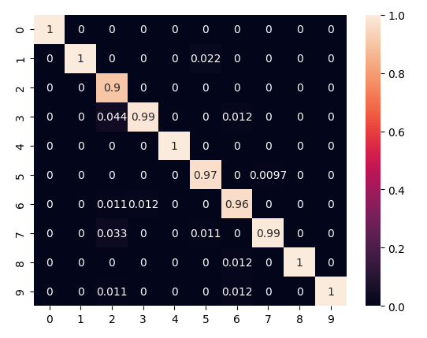

# Sound Recognition

Simple recognition of spoken digits, using 2 deep learning models that were created and trained with Keras.

Dataset
======
The used dataset is [Free Spoken Digit Dataset (FSDD)](https://github.com/Jakobovski/free-spoken-digit-dataset "Free Spoken Digit Dataset (FSDD)"), that is an open source dataset containing audio records of spoken digits 0-9. Features used to train models were MFCCs and Melspectrograms.

Models
=====
Two Neural networks were created, based on convolutions and LSTM. Best result in F1-Score was achived by CNN model that used MFCC as an input.

| Metric |  CNN (Melspectrogram) | CNN (MFCC)  |  LSTM (MFCC) |
| ------------ | ------------ | ------------ | ------------ |
| F1-Score  |  0.93 | 0.98  | 0.92  |

Confusion Matrix of CNN (MFCC) model

 
Confusion Matrix

